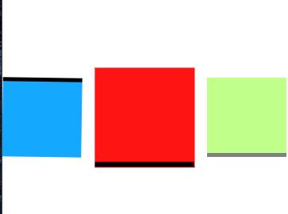
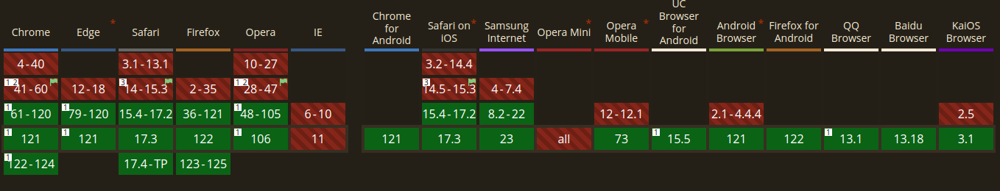
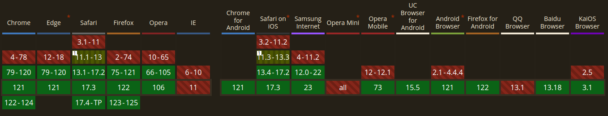

# New Css Features

before we continue these are new features so check the compatibility!

## Scroll



its a Css function that can be used in `animation-timeline`for animating the element by the scroll progress. the value of scroll range converted to percentage : 0% to 100%

### Syntax

```css
animation-timeline: scroll();

/* Values for selecting the scroller element */
animation-timeline: scroll(nearest); /* Default */
animation-timeline: scroll(root);
animation-timeline: scroll(self);

/* Values for selecting the axis */
animation-timeline: scroll(block); /* Default */
animation-timeline: scroll(inline);
animation-timeline: scroll(y);
animation-timeline: scroll(x);

/* Examples that specify scroller and axis */
animation-timeline: scroll(block nearest); /* Default */
animation-timeline: scroll(inline root);
animation-timeline: scroll(x self);
```

what are these arguments :

`axis` - The scrollbar axis value can be any one of the following:

- `block` :The scrollbar on the block axis of the scroll container, which is the axis in the direction perpendicular to the flow of text within a line. For horizontal writing modes, such as standard English, this is the same as `y`, while for vertical writing modes, it is the same as `x`. This is the default value.
- `inline` :The scrollbar on the inline axis of the scroll container, which is the axis in the direction parallel to the flow of text in a line. For horizontal writing modes, this is the same as x, while for vertical writing modes, this is the same as y.
- `y` :The scrollbar on the vertical axis of the scroll container.

- `x` :The scrollbar on the horizontal axis of the scroll container.

`scoller` - The value for indicating the scroller element that will provide the scroll progress timeline can be any one of the following:

- `nearest` :The nearest ancestor of the current element that has scrollbars on either axis. This is the default value.
- `root`: The root element of the document.
- `self` :The current element itself.

**_see the example!_**

### Can I Use Scroll ?



## Clamp

`clamp()`is a Css Function.just like `calc()` , `min()` , `max()` and ...
so how its work?
its clamp a middle value within a range of values between a defined minimum bound and a maximum bound.

this function has three parameters :

- **min value** : If the preferred value is less than this value, the minimum value will be used.
- **preferred value** :The preferred value is the expression whose value will be used as long as the result is between the minimum and maximum values.notice this Preferred value usually includes viewport units, percentages, or other relative units to achieve the fluid effect!
- **max value**:assigned if the preferred value is greater than this upper bound.

### Syntax

```css
font-size: clamp(1rem, 2.5vw, 2rem);
font-size: clamp(1.75rem, 5vw, 4rem);
```

you can combine functions :

```css
--big-width: 900px;
width: clamp(100px, calc(30% / 2rem + 10px), var(--big-width));
```

you can see the example in the `style.css`.

how its implemented,behind the scene !
`max(MIN, min(VAL, MAX))`

### Important part : Fluid Typography

so what that mean?
this is a responsive typography technique where the text scales automatically with the screen size

#### Why we need that?

developers always use `media Query` to making a website responsive . so with that we adjust the font size just in some breakpoints like `14440px` or smaller devices `495px` but in this method we adjust `font size` ro `line height` or `letter spacing` smoothly !

> look at this repo for more information : [link](https://github.com/codeAdrian/modern-fluid-typography-editor)

example :

```js
font-size: clamp(32px, 4vw, 48px);

// if view port width 500 px
// preferred value 20 px
// then applied value 32 px clamped to minimum!

// if view port width 900 px
// preferred value 36 px
// then applied value 36 px between min and max!

// if view port width 1400 px
// preferred value 56 px
// then applied value 48 px clamped to maximum!
```

### Can I use Clamp ?

Browser support for `clamp` function sits above 90% . so we can use that :)



## Nesting

just like Sass and Emotion you can simply nest elements

```css
/* before */
.foo {
  color: red;
}
.foo .bar {
  color: blue;
}

/* after */

.foo {
  color: red;

  .bar {
    color: blue;
  }
}

/* before */
.foo {
  color: red;
}
.foo:hover {
  color: blue;
}

/* after */
.foo {
  color: red;

  &:hover {
    color: blue;
  }
}
```
